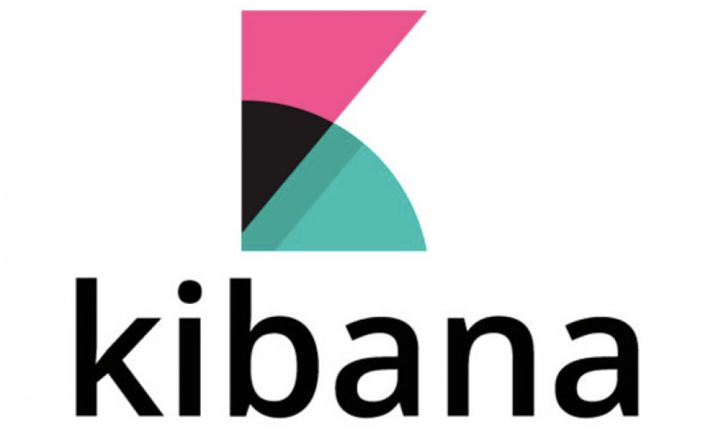

## **Mục Lục**
  - [**I. Logging & Tracing**](#L&T)
    - [**1. Elasticsearch**](#1-elasticsearch)
    - [**2. Fluentd**](#2-fluentd)
    - [**3. Kibana**](#3-kibana)
  - [**II. Practice**](#tn)
    - [**1. Cài đặt**](#cd)
    - [**2. Kết quả**](#kq)
  - [**III. Reference**](#re)
---
## **I. Giới thiệu về Logging & Tracing**


### **1. Elasticsearch**

- Elasticsearch là một search engine.
- Elasticsearch được kế thừa từ Lucene Apache
- Elasticsearch thực chất hoặt động như 1 web server, có khả năng tìm kiếm nhanh chóng (near realtime) thông qua giao thức RESTful
- Elasticsearch có khả năng phân tích và thống kê dữ liệu
- Elasticsearch chạy trên server riêng và đồng thời giao tiếp thông qua RESTful do vậy nên nó không phụ thuộc vào client viết bằng gì hay hệ thống hiện tại của bạn viết bằng gì. Nên việc tích hợp nó vào hệ thống bạn là dễ dàng, bạn chỉ cần gửi request http lên là nó trả về kết quả.
- Elasticsearch là 1 hệ thống phân tán và có khả năng mở rộng tuyệt vời (horizontal scalability). Lắp thêm node cho nó là nó tự động auto mở rộng cho bạn.
- Elasticsearch là 1 open source được phát triển bằng Java

  


### **2. Fluentd**

- Fluentd là một công cụ thu thập, xử lý và tổng hợp nhật ký mã nguồn mở được tạo ra vào năm 2011 bởi những người tại Treasure Data . 
- Được viết bằng Ruby, Fluentd được tạo ra để hoạt động như một lớp ghi nhật ký thống nhất - một thành phần duy nhất có thể tổng hợp dữ liệu từ nhiều nguồn, thống nhất dữ liệu được định dạng khác nhau thành các đối tượng JSON và định tuyến nó đến các đích đầu ra khác nhau.

### **3. Kibana**

- Kibana là một công cụ hiển thị trực quan và khám phá dữ liệu được sử dụng trong những trường hợp phân tích nhật ký và chuỗi thời gian, giám sát ứng dụng và thông tin kinh doanh. Công cụ này cung cấp những tính năng mạnh mẽ, dễ sử dụng như biểu đồ tần suất, biểu đồ đường, biểu đồ tròn, biểu đồ nhiệt và hỗ trợ không gian địa lý được tích hợp sẵn. Ngoài ra, công cụ này còn cung cấp khả năng tích hợp chặt chẽ với Elasticsearch, một công cụ phân tích và tìm kiếm phổ biến, khiến Kibana trở thành lựa chọn hàng đầu cho hoạt động hiển thị trực quan dữ liệu được lưu trữ trong Elasticsearch.



## **III. Practice**
<a name="cd"></a>
### **1. Cài đặt**

- Cấu hình `Dockerfile` để tạo container Fluentd:

  ```yml
  FROM fluent/fluentd:v1.9
  USER root

  RUN apk add --no-cache --update --virtual .build-deps \
      sudo build-base ruby-dev \
      && gem install fluent-plugin-elasticsearch \
      && gem sources --clear-all \
      && apk del .build-deps \
      && rm -rf /tmp/* /var/tmp/* /usr/lib/ruby/gems/*/cache/*.gem

  USER fluent
  ``` 

- Cấu hình file `fluent.conf`:

  ```
  <source>
    @type forward
    port 24224
    bind 0.0.0.0
  </source>

  <match *.**>
    @type copy
    <store>
      @type elasticsearch
      host 27.71.229.80
      port 9200
      logstash_format true
      logstash_prefix tranthanhien
      include_tag_key true
    </store>
    <store>
      @type stdout
    </store>
  </match>
    ```

  - Cấu hình file `docker-compose-fluentd.yml`:
    ```yml
    version: '3.3'
    services:
      fluentd:
        build: .
        container_name: fluentd
        volumes:
          - ./:/fluentd/etc
        ports:
          - "24224:24224"
   ```
- Trong file   `docker-compose.yml`, thêm logging vào images của flask và nginx
    ```yml
  logging:
      driver: "fluentd"
      options:
        fluentd-address: "0.0.0.0:24224"
        tag: flask 
    ```
    
    ```yml
  logging:
      driver: "fluentd"
      options:
        fluentd-address: "0.0.0.0:24224"
        tag: nginx 
    ```
<a name="kq"></a>
### **2. Kết quả**
> chạy lệnh
  ```
  docker-compose -f docker-compose-fluentd.yml up
  ```

> chạy lệnh
  ```
  docker-compose up -d
  ```

## **III. Reference**

[Elasticsearch là gì?](https://viblo.asia/p/elasticsearch-la-gi-1Je5E8RmlnL)

[Kibana](https://levanphu.info/kibana-la-gi-tim-hieu-ve-kibana-va-su-dung-mot-cach-hieu-qua)

[Fluentd](https://docs.fluentbit.io/manual/about/fluentd-and-fluent-bit)
